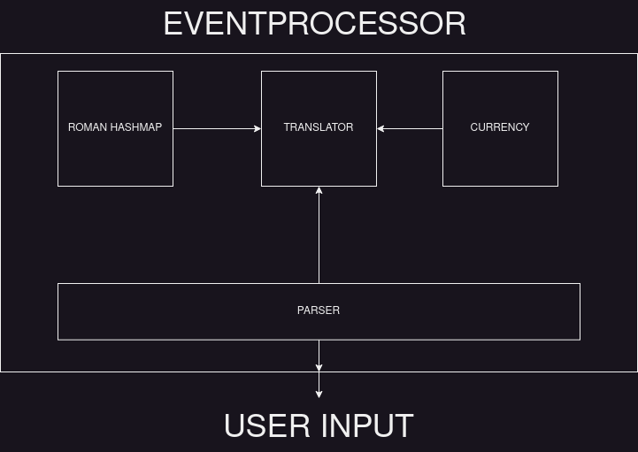

# Galactic Merchant Trading Guide
## System Design


This application has 5 main object that have their respective responsibilities.
 - **ROMAN HASHMAP** : This object save roman number as a key and arabic number as a value.
 - **TRANSLATOR**: Used to change the foreign word to arabic value number. Translator depends on Roman Hashmap And Currency Object.
 - **CURRENCY**: Used to store information about currency like IRON, SILVER GOLD.
 - **PARSER**: extract information from statement using Regex that user write. Information that can be extract can be new Currency, foreign numbers and question.
 - **EVENTPROCESSOR**: used as the bridge/connector between input, processor, and output. Eventprocessor decide what type of statement that user input and decide what the output.

## Requirements
 - Go >= 1.20

## Installation
Just clone this repository and make sure go was installed on your machine


## Testing
Run test:
`` go test ./... -v -cover``

## Running
`` go run main.go or ./run.sh``

## Example
**Create a new foreign word based on symbols of Roman numerals**
Enter it one by one line
```
glob is I
prok is V
pish is X
tegj is L
```

**Create new currency value**
```
glob glob Silver is 34 Credits
glob prok Gold is 57800 Credits
pish pish Iron is 3910 Credits
```

**Get the arabic value of foreign words**
Input:
```json
how much is pish tegj glob glob ?
```
Output:
```json
pish tegj glob glob is 42
```

**Find the Credit value based on foreign number and foreign currency**
Input:
```json
how many Credits is glob prok Silver ?
```
Ouput:
```json
glob prok Silver is 68 Credits
```

**Check if one foreign number has more than another foreign number**
Input:
```json
Does pish tegj glob glob Iron has more Credits than glob glob Gold 
```

Output:
```json
pish tegj glob glob Iron has less Credits than glob glob Gold
```


**Check if one foreign number has less than another foreign number**
Input:
```json
Does glob glob Gold has less Credits than pish tegj glob glob Iron? 
```

Output:
```json
glob glob Gold has more Credits than pish tegj glob glob Iron
```

**Check if one foreign number is larger than another foreign number**
Input:
```json
Is glob prok larger than pish pish? 
```

Output:
```json
glob prok is smaller than pish pish
```

**Check if one foreign number is smaller than another foreign number**
Input:
```json
Is tegj glob glob smaller than glob prok?
```

Output:
```json
tegj glob glob is larger than glob prok
```

**Unknown statemtn**

Input:
```json
how much wood could a woodchuck chuck if a woodchuck could chuck wood ?
```
Output:
```json
I have no idea what you are talking about
```